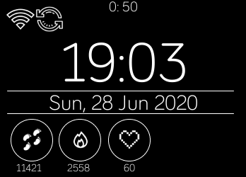

# fitbit_app
This project has the purpose to obtain data each five minutes of user, I've developed the interface and logic with Js using the Fitbit API.

## At the top of the diplay you can see the countdown, this countdown indicate that takes the data each five minutes, besides, if there isn't internet o synchronization the data will be store until there will be internet and sychronization.Other wise you can see the clock and date and at the bottom of the display you can see de Heart Frequency Rate current, calories and steps.
